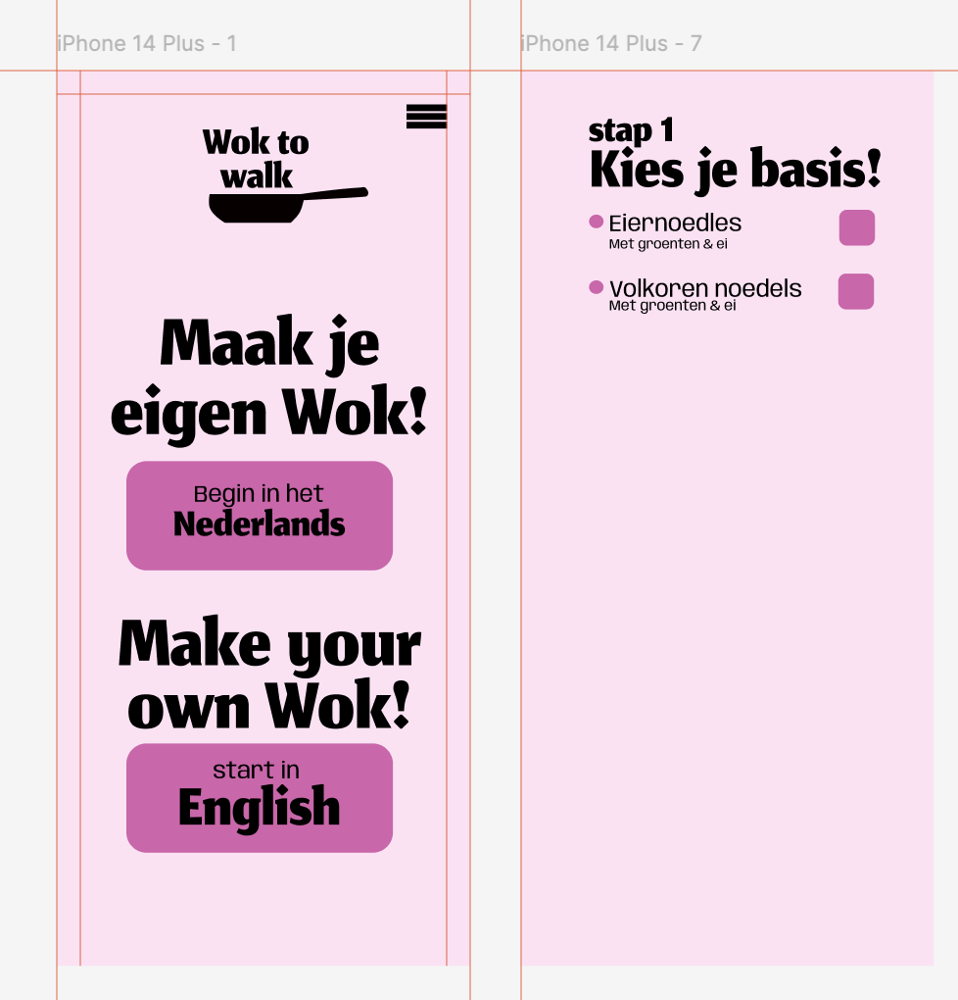

# Model

Het staat model voor digitale tuintjes welke bij 'Het web is voor iedereen' door studenten worden gemaakt.

## Learning Log

## 31 Augustus. 
ik heb alles geinstaleerdt, en gekoppled wat gekoppled moest worden. Helaas kon ik niet VS codium gebruiken omdat mijn computer het niet aankon. 
dus code ik in VS code, 

vragen: Leg uit wat een source hosting platform is en voor welke jij gekozen hebt.
-Het is het platform waar je je website op zet zodat hj ergens gebacked staat.
Ik heb gekozen voor github-

Vertel welke domeinnaam jij gekozen hebt en hoe je die hebt gekoppeld aan jouw pagina.
-mijn domijn naam is Joyportfolio. Omdat ik mijn portfolio hier aan wil linken.

Ik heb dit gedaan door het via NSD te koppelen. Github van deze verifieren. En hiermee kan je met VS code schrijven.-

Beschrijf hoe je aanpassingen aan jouw pagina kunt maken en hoe je er voor zorgt dat die op het web gepubliceerd worden.
-Door het het op te slaan bij Github, En via hier wordt je website oprecht gerealizeerdt. En gekoppeled tot het bestaande domijn.-

[...]

### 3 sept - [Workshop]

In deze workshop (de workshop Interactie: MMD, micro-interacties, forms) hadden we verschillende dingen weer terug gehaalt. Waarvan ook verschillenden design elementen zoals de affordance.

Hier heb ik een wok to walk oefening gemaakt. Zodat je weer kon oefenen met de elementen waar we net mee hadden gewerkt. Ik heb geprobeerdt cue's en de anderen elementen in de user interaction te zetten.

Hier heb ik een duidelijke en goede opfrisser gehad. En konden we weer design wise wakker geworden.

Later werdt ons aangeraden om meer onderzoek te doen. En meer om ons heen te kijken voordat we ontworpen. Ook om meer te schetsen. Dit had ik deze keer niet gedaan vanwegen het gebrek van tijd.
Maar in anderen momenten zou ik dit zeker doen.

Bij de tweede les had ik (font in css). Hierbij hadden we verschillende dingen geleerdt over fonts en font-face. 
Dit zijn dingen die ik al had geleerdt. Maar het was erg fijn om met een nieuw persoon deze informatie te krijgen. Ook kregen wij info over welke fonts illegaal waren en niet. Zo mogen we google and adobe progromma's niet gebruiken. Behalven als we het downloaden van tevoren en in de map zetten. 

Hierna hebben we verschillende opdrachten gedaan. Deze heb ik afgerond. Ik heb hulp gevraagt aan een klasgenoot en een leraar. 

Dit zijn de screenshots van de opdrachten
opdracht 1

opdracht 2

opdracht 3

opdracht 4
 <source src="../Joy.Portfolio.ect/images/opdracht_4.mov" type="video/mp4">

 <source src="../Joy.Portfolio.ect/images/opdracht_4_2.mov" type="video/mp4">

[...]

